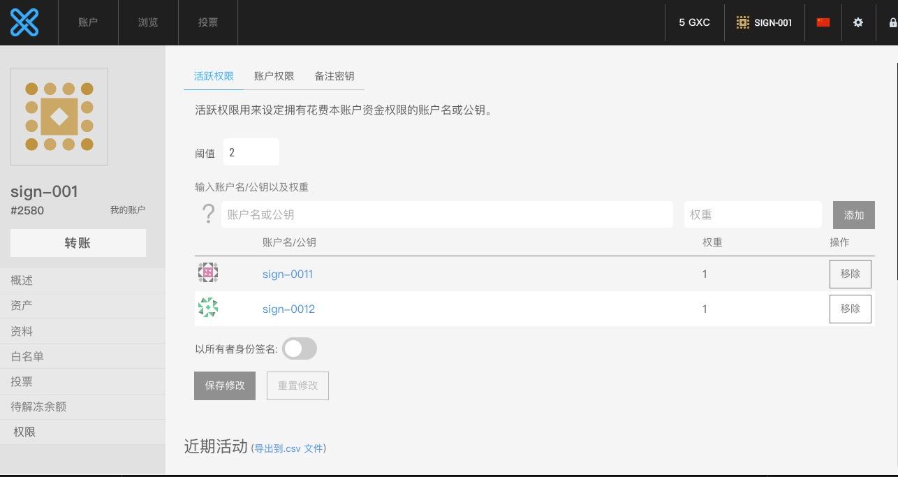
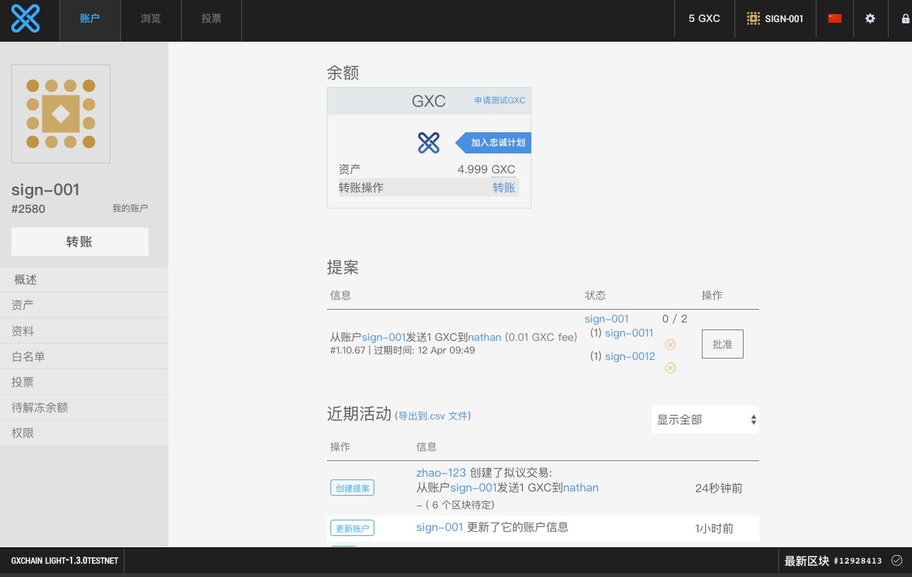

# 多重签名使用教程

GXChain支持多重签名，本篇教程讲解如何在GXChain上使用多重签名转账

## 设置多签账户

使用网页钱包创建账户，并打开网页钱包权限页面，添加子账户来控制该账户的资产，并更新账户信息。

其中阈值表示控制该账户资金所需要的权重之和，假设阈值为2，则只要任意权重之和相加超过阈值的子账户，可以控制该账户资产。

这里创建一个`sign-001`账户，并将其权限下发给`sign-0011`和`sign-0012`两个子账户，并将两个子账户导入到不同的钱包中，两个子账户权重分别为1。阈值为2，表示只有两个账户全部同意，才可以将`sign-001`账户的资金转出。

## 通过提案发起转账

控制多签账户的资产，需要得到权重之和不低于阈值的多个子账户同意。我们可以使用发起转账提案，并得到子账户批准的方式，来发起转账。首先我们先使用任意账户发起提案交易，交易的转出方为多签账户`sign-001`。

在转账页面，设置转出账户为`sign-001`，此时若没有该账户的权限，则会提示（提议），点击“提议”，发起提案交易。

点击提议，发起提案交易

此时，在`sign-001`账户页面，会显示一个待审批的提案，如下图所示：

## 多签账户批准提案

我们分别使用`sign-0011`和`sign-0012`账户同意提案，来控制资产的转出

在`sign-0011`账户下，批准提案

两个账户全部审批通过，转账发起

